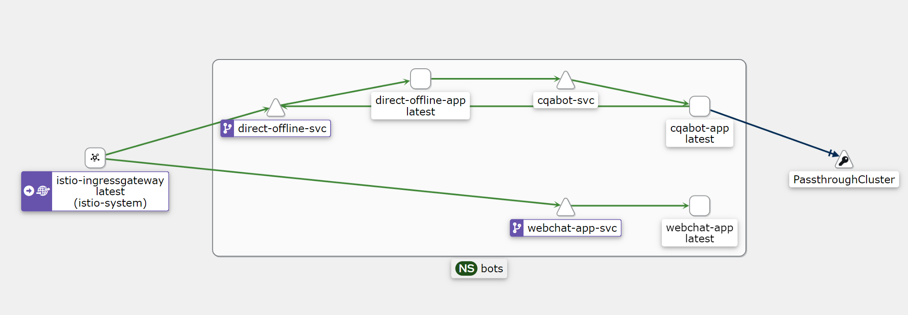

# Azure Bot on AKS with Istio service mesh

Once deployed here is view of the components in Kiali



- istioctl dashboard kiali

# Istio Ingress TLS Termination + MTLS to pods

- Install Istio with default profile
- Configure Secure Istio Ingress following steps in https://istio.io/latest/docs/tasks/traffic-management/ingress/secure-ingress/#configure-a-tls-ingress-gateway-for-a-single-host


## Create self signed test certs

- create certificate for Ingress gateway frontend
```sh
mkdir bot_certs1

openssl req -x509 -sha256 -nodes -days 365 -newkey rsa:2048 -subj '/O=Bot Inc./CN=example.com' -keyout bot_certs1/example.com.key -out bot_certs1/example.com.crt

openssl req -out bot_certs1/bot.example.com.csr -newkey rsa:2048 -nodes -keyout bot_certs1/bot.example.com.key -subj "/CN=bot.example.com/O=Bot organization"

openssl x509 -req -sha256 -days 365 -CA bot_certs1/example.com.crt -CAkey bot_certs1/example.com.key -set_serial 0 -in bot_certs1/bot.example.com.csr -out bot_certs1/bot.example.com.crt

 kubectl create -n istio-system secret tls bot-credential \
  --key=bot_certs1/bot.example.com.key \
  --cert=bot_certs1/bot.example.com.crt
```

## Deploy Bot application

All Istio and TLS updated manifests are in [manifests/tls](manifests/tls) 

- Deploy NS with sidecar auto injection `bot-ns.yaml`

- Update Bot dotnet app settings pointing to Language service `bot-app-cm.yaml` and deploy
- Deploy Bot Application `bot-app-acr.yaml` [Reaplace ACR name]

- Update DirectlineOffline app settings `directline-offline-app-acr.yaml` and deploy [Reaplace ACR name]
  Directline Domain env setting is name (internal  DNS) of Directline service as it is used by Bot Pod internally and could be resolved.

- [Optionally] Replace in `webchat\index.html` directline DNS name to point to Ingress and rebuild Container (or pass it  later in URL  parameter `uri` without performing a change )
- Update WebChat Sample app `webchat-app-acr.yaml` and deploy [Reaplace ACR name]


- Verify Pods are running with Istio sidecar

# Deploy Bot Gateway and Visrtual Services

- Deploy Ingress Gateway resource load balancing requests to Bot's namespace pods and setting TLS 
 [`manifests/tls/bot-gtwy.yaml`](manifests/tls/bot-gtwy.yaml)

```yaml
apiVersion: networking.istio.io/v1alpha3
kind: Gateway
metadata:
  name: bot-gateway
  namespace: bots
spec:
  selector:
    istio: ingressgateway # use istio default ingress gateway
  servers:
  - port:
      number: 443
      name: https
      protocol: HTTPS
    tls:
      mode: SIMPLE  #MLTLS
      credentialName: bot-credential # must be the same as secret
    hosts:
    - bot.example.com
```

## Virtual Services for DirectLine and WebShat

We do not set VirtualService for Bot pods as they are reached by directline inside cluster.
Note: If need to test from Bot Emulator directly connecting to Bot - then setup VirtalService for bot pods as well.

- Webshat Visrtual Service [`manifests/tls/webchat-vs.yaml`](manifests/tls/webchat-vs.yaml)

```yaml

apiVersion: networking.istio.io/v1alpha3
kind: VirtualService
metadata:
  name: webchat
  namespace: bots
spec:
  hosts:
  - "bot.example.com"
  gateways:
  - bot-gateway
  http:
  - match:
    - uri:
        prefix: /
    route:
    - destination:
        port:
          number: 8080
        host: webchat-app-svc
```        


- DirectLine VirtualService [`manifests/tls/directline-offline-vs.yaml`](manifests/tls/directline-offline-vs.yaml)

```yaml
apiVersion: networking.istio.io/v1alpha3
kind: VirtualService
metadata:
  name: directoffline
  namespace: bots
spec:
  hosts:
  - "bot.example.com"
  gateways:
  - bot-gateway
  - mesh
  http:
  - match:
    - uri:
        prefix: /directline
    route:
    - destination:
        port:
          number: 3000
        host: direct-offline-svc
```


# Testing

- Check Ingress IP and Ports
export INGRESS_NAME=istio-ingressgateway
export INGRESS_NS=istio-system
export INGRESS_HOST=$(kubectl -n "$INGRESS_NS" get service "$INGRESS_NAME" -o jsonpath='{.status.loadBalancer.ingress[0].ip}')
export INGRESS_PORT=$(kubectl -n "$INGRESS_NS" get service "$INGRESS_NAME" -o jsonpath='{.spec.ports[?(@.name=="http2")].port}')
export SECURE_INGRESS_PORT=$(kubectl -n "$INGRESS_NS" get service "$INGRESS_NAME" -o jsonpath='{.spec.ports[?(@.name=="https")].port}')
export TCP_INGRESS_PORT=$(kubectl -n "$INGRESS_NS" get service "$INGRESS_NAME" -o jsonpath='{.spec.ports[?(@.name=="tcp")].port}')

- curl example:
curl -v -HHost:bot.example.com --resolve "bot.example.com:$SECURE_INGRESS_PORT:$INGRESS_HOST" \
  --cacert bots_certs1/example.com.crt "https://bot.example.com:$SECURE_INGRESS_PORT/"

- Browser

https://bot.example.com?uri=https://bot.example.com