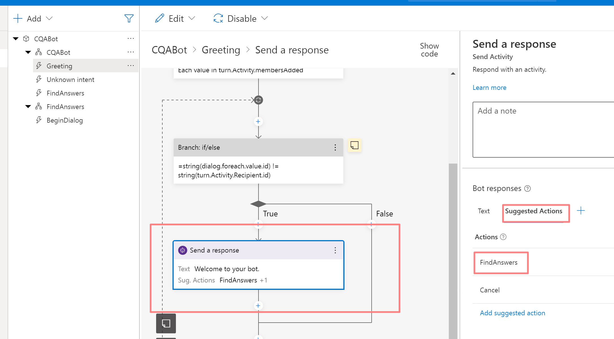

In this example we will demonstrate how to build Bot with Bot composer which will query Language Service Knowledge Base and deploy bot to AKS as docker container

Here is Logical Flow view for all Components


Deployement Architure (on private locked network)


# Build and Deploy everything
Create AKS and ACR and get creadentials from AKS
Prerequisites 

- AZ cli and kubectl
- create AKS and ACR
- Create Language service and project with KB
- Update appsettings.json and appsettings.Production.json with setting for language service

```sh
az login --tenant <TENANTID>
./buildall.sh <ACRNAME>
./deployall.sh <ACRNAME>
```


# Create Custom Language answering KB 

## Prerequisites
- This project requires a [Language resource](https://aka.ms/create-language-resource) with Custom question answering enabled.

### Configure knowledge base of the project
- Follow instructions [here][Quickstart] to create a Custom question answering project. You will need this project's name to be used as `ProjectName` in [appsettings.json](appsettings.json).
- Visit [Language Studio][LS] and open created project.
- Go to `Edit knowledge base` -> Click on `...` -> Click on `Import questions and answers` -> Click on `Import as TSV`.
- Import [SampleForCQA.tsv](SampleForCQA.tsv) file.
- You can test your knowledge base by clicking on `Test` option.
- Go to `Deploy knowledge base` and click on `Deploy`.


# Build Bot with Bot Composer

- Install and launch Bot Composer, create Empty bot (C#) template
For this project set Recognizer to Regex - we are not using LU


- Add new Find Answers Intent and Dialog that could collect user question and query KB


- Update Greeting dialog to suggest Bot capabilities



- Update FindAnsers Dialog to get user input and send it to Language service


user input is stored  in `user.question` variable on user scope


REST call is sent to language `hostname` and `projectname` and use `endpointKey` for the service obtained from Azure Language Service.This settings need to be configured in Bot settings Json.


- Test Bot in Test Emulator


# Deploy Bot
Composer generates ASP.NET Core based code that could be run in Docker on AKS

## Set Language Service settings
Secrets are not stored in repo to add Language service `endpointKey` add `settings/appsettings.Production.json` file with key for CQA endpoint:

```json
{
  "qna": {
    "endpointKey": "xxxxx"
  }
}
```

# Build Bot Container

```
docker  build -t cqabot .
docker tag cqabot <ACR>.azurecr.io/cqabot

az login --tenant <TENANTID>
az acr login  --name acrforbots
docker push <ACR>.azurecr.io/cqabot
```

## Test Bot Loacally

```sh
docker run -it --rm -p 3978:3978 --name cqa_sample cqabot
```

# Deploy Bot to AKS
Create ACR and Kubernetes

Replace in `bot-app-acr.yaml` ACRName to the registry name you have careted

```sh
kubectl create ns bots
kubectl apply -f bot-app-acr.yaml
```

Check EXTERNAL-IP for the LB service in front of Bot pods
```
$ kubectl get svc -A
NAMESPACE     NAME                 TYPE           CLUSTER-IP     EXTERNAL-IP      PORT(S)          AGE
bots          cqabot-svc           LoadBalancer   10.0.116.164   20.220.134.77   3978:32710/TCP   2d4h
default       kubernetes           ClusterIP      10.0.0.1       <none>           443/TCP          2d20h
kube-system   kube-dns             ClusterIP      10.0.0.10      <none>           53/UDP,53/TCP    2d20h
```

# Connect Bot Emulator to Remote AKS Bot 

- Make sure to install ngrok version 2 (no support for latest version 3 yet)
- Install Bot Emulator

- connect Emulator to Remote Bot add URL


# Build and Deploy Direct offline container

Same stepts to build DirectOffline container and deploy to AKS

```
docker  build -t direct-offline .
docker tag cqabot <ACR>.azurecr.io/direct-offline

az login --tenant <TENANTID>
az acr login  --name acrforbots
docker push <ACR>.azurecr.io/direct-offline
```

- Run locally
```
docker run -it --rm -p 3000:3000 --name direct_sample direct-offline
```


- Deploy on AKS

Replace in YAML for `directline-offline/direct-offline-app.yaml` IP of the directline service in environment variable `DIRECTLINE_DOMAIN`

```yaml
    spec:
      containers:
      - name: direct-offline-app
        image: acrforbots.azurecr.io/direct-offline:latest
        ports:
        - containerPort: 3000
        env:
        - name: BOT_URL
          value: http://cqabot-svc.bots.svc.cluster.local:3978/api/messages
        - name: DIRECTLINE_DOMAIN
          value: 20.175.199.127
```


```sh
kubectl apply -f directline-offline/direct-offline-app.yaml
```

TODO: REPLACE with static IP

# Build WebChat app

Replace in  `webchat/index.html` domain with IP for DirectLine Service:

```
const botConnectionSettings = new BotChat.DirectLine({
            secret: '1234',
            token: '123',
            domain: 'http://20.175.199.127:3000/directline',
            webSocket: false // defaults to true
         });
```

- build docker
```
docker  build -t webchat .
docker tag cqabot <ACR>.azurecr.io/webchat

az login --tenant <TENANTID>
az acr login  --name acrforbots
docker push <ACR>.azurecr.io/webchat
```

- deploy in AKS

```sh
kubectl apply -f webchat/webchat-deploy.yaml
```

- Access web chat

http://IP_OF_LB:8080/index.html


